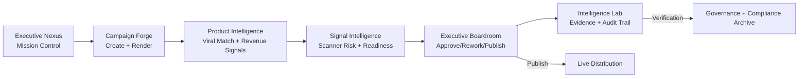
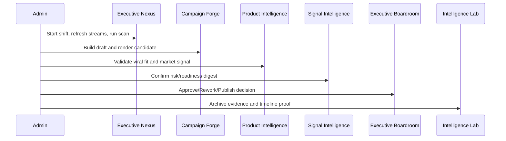

# EVICS Marketing Engine
## Admin and Owner Training Manual

Version: 2026-06-22
Audience: Admin, Owner, Executive Operator
System: EVICS Elite Executive Workspace
Primary URL: http://localhost:8082/workspace

---

## 1. Executive Overview

EVICS is a full-cycle marketing operations engine that turns product intent into publish-ready media through a controlled workflow.

The admin operating objective is simple:

1. Build and route media assets.
2. Validate quality and risk signals.
3. Make board-level publish decisions.
4. Preserve proof and audit evidence.

The workspace is now intentionally organized around this operating flow:

1. Executive Nexus
2. Campaign Forge
3. Product Intelligence
4. Signal Intelligence
5. Executive Boardroom
6. Intelligence Lab

This sequence is your required daily path from start to finish.

---

## 2. System Map (Illustrated)

---

## 3. Top Bar and Global Controls (Top to Bottom)

### 3.1 Master Power
Purpose:
- Toggles command-center runtime posture and visual operating state.

Use:
1. Click Master Power to switch between active pulse and standby posture.
2. Use active mode during operations windows.
3. Use standby mode during review/training windows.

### 3.2 Products / Runtime / Workspace Links
Purpose:
- Quick cross-navigation to product dashboard, runtime health, and main workspace.

Use:
1. Products for catalog/product checks.
2. Runtime for system health confirmation.
3. Workspace to return to mission operations.

### 3.3 VP Button
Purpose:
- Opens VP terminal for text/voice directives and mission-level execution shortcuts.

Use:
1. Click VP to open terminal.
2. Start Voice or use typed directive.
3. Use for supervisory commands, not routine stage work.

---

## 4. Left Navigation (Pipeline Workflow Rail)

This left rail is now workflow-only by design. Each button is a stage in the production lifecycle.

### 4.1 Executive Nexus
Function:
- Live mission dashboard and orchestration overview.
- Houses KPI snapshots and primary action controls.

Primary actions:
1. Run Executive Scan
2. Refresh Streams
3. Review strategic alerts

### 4.2 Campaign Forge
Function:
- Asset creation and render orchestration lane.

Primary actions:
1. Create or edit draft title/script.
2. Attach source viral video context.
3. Send asset to render.
4. Move assets through queue/render/review lanes.

### 4.3 Product Intelligence
Function:
- Product-level viral pattern and revenue signal intelligence.

Primary actions:
1. Run VP-assist or continuous product scans.
2. Inspect top products by performance.
3. Evaluate platform and video-type breakout.
4. Route insights back into campaign decisions.

### 4.4 Signal Intelligence (Executive Scanners)
Function:
- Scanner control plane and risk/readiness digest for admins.

Primary actions:
1. Pause/Enable scanner.
2. Set interval and duration.
3. Run scan on demand.
4. Read compact digest (not redundant line spam).

### 4.5 Executive Boardroom
Function:
- Final decision layer for approve/rework/publish.

Primary actions:
1. Review preview-ready assets.
2. Compare source versus EVICS render.
3. Approve, request rework, or publish.
4. Review mission pressure and forecast context.

### 4.6 Intelligence Lab
Function:
- Evidence archive and audit-grade traceability.

Primary actions:
1. Validate pipeline run records.
2. Inspect source/render proof links.
3. Review timeline event evidence.
4. Export findings for governance review.

---

## 5. Executive Nexus (Step-by-Step Operating Procedure)

Use this sequence at the start of every shift:

1. Open Executive Nexus.
2. Confirm Master Power is active.
3. Click Refresh Streams.
4. Review KPI tiles for anomaly spikes.
5. Click Run Executive Scan.
6. If alerts are clean, move to Campaign Forge.
7. If alerts are elevated, move to Signal Intelligence and resolve before publish.

Operational rule:
- Never skip scanner and board checks before publish decisions.

---

## 6. Executive Scanners (Signal Intelligence) - Detailed Guide

### 6.1 Why this was changed
The previous UI surfaced repetitive finding lines that were noisy for admin decisions.

Now:
- Full scanner logic is still retained in the engine.
- Admin view is compact and decision-oriented.

### 6.2 Controls and meaning

1. Pause Scanner / Enable Scanner
- Temporarily disables or enables auto scanner execution.

2. Run Scan
- Executes an immediate scan cycle.

3. Refresh
- Pulls latest scanner state from backend.

4. Enabled
- Boolean control of scanner active state.

5. Interval (minutes)
- Scanner cycle frequency.

6. Duration (seconds)
- Runtime budget for each scan cycle.

7. Save Scanner Settings
- Commits the above scanner values.

### 6.3 Digest metrics and what to do

1. Status
- Current scanner lifecycle state.

2. Findings
- Total finding count across current cycle.

3. Blocked
- Number of pipeline blocks currently enforced.

4. High / Medium / Low
- Severity-distribution digest.

5. Top Scanner Themes
- Deduplicated issue themes, ranked by recurrence.

Action guidance:
1. High > 0 with board-ready assets: hold publish decisions.
2. Medium-only with no board impact: continue with caution and document.
3. Repeated top theme across runs: open root-cause correction task.

---

## 7. Campaign Forge (Build and Render)

### 7.1 Draft creation
1. Enter title.
2. Enter script.
3. Provide source viral URL.
4. Save Draft.

### 7.2 Render handoff
1. Send to Render.
2. Start render job.
3. Attach provider preview when complete.
4. Move asset to review.

### 7.3 Lane policy
- Queue: waiting for render resources.
- Rendering: active provider processing.
- Review Pending: board review required.
- Approved: publish-eligible only after quality gates pass.

---

## 8. Product Intelligence (Viral Signal Operations)

### Core admin workflow
1. Start VP-assist scan for one controlled pass.
2. Review top products by revenue and publish counts.
3. Review platform leaderboard.
4. Feed winning patterns into next campaign draft.

When to use continuous scan:
- During active campaigns with high creative velocity.
- When ongoing market adaptation is needed.

---

## 9. Executive Boardroom (Decision Governance)

### Review process
1. Open review-ready asset.
2. Compare source reference and generated render.
3. Validate quality gate indicators.
4. Decide:
- Approve
- Request Rework
- Hold

### Publish process
1. Confirm asset in approved state.
2. Confirm no blocking scanner or governance condition.
3. Publish now.
4. Confirm transition to published state and evidence entry.

---

## 10. Intelligence Lab (Evidence and Audit)

Use this space for defensible operations recordkeeping.

Checklist:
1. Verify pipeline run card exists.
2. Verify source and render proof links are present.
3. Verify timeline events include key lifecycle milestones.
4. Verify publish decisions have trace context.

---

## 11. VP Terminal Operations

Core controls:
1. Run Directive
2. Open Executive Boardroom
3. Sync Mission Status
4. Lock/Unlock Ops Mode
5. Start Voice/Stop Voice

Common directives:
1. render and publish 5 videos
2. open board
3. run scan
4. unlock ops mode
5. lock ops mode

Safety note:
- Use VP directives for executive automation, not routine single-asset handling.

---

## 12. Advanced Workspaces (Now at Bottom of Command Center)

These are intentionally moved out of left navigation to prevent admin confusion.

### 12.1 Viral Dynamics
- VER policy weighting and category-level momentum controls.

### 12.2 Market Heatmaps
- Region/platform/creator/narrative/product drilldowns.

### 12.3 Creator Intelligence
- Connected app operations and prompt command controls.

### 12.4 Semantic Memory
- Pattern memory and semantic signal reference.

### 12.5 Autonomous Ops
- Agent orchestration activity and autonomous controls.

### 12.6 Strategic Forecasting
- Stage distribution and forecast-level trend interpretation.

### 12.7 System Core
- Runtime internals and infrastructure-level state.

---

## 13. Daily Admin Playbook

Morning startup:
1. Executive Nexus: refresh streams and run scan.
2. Signal Intelligence: verify digest severity and top themes.
3. Campaign Forge: process queue and rendering items.
4. Product Intelligence: pull fresh signal summary.
5. Executive Boardroom: run review and publish cycle.
6. Intelligence Lab: confirm evidence completeness.

Midday control loop:
1. Re-run scan.
2. Resolve new high-severity themes.
3. Validate mission throughput and failures.

End-of-day closeout:
1. Publish final approved assets.
2. Confirm evidence archive completeness.
3. Leave scanner settings in standard interval profile.

---

## 14. Troubleshooting Quick Guide

Issue: Too many scanner findings
- Use Signal Intelligence digest instead of raw line-by-line findings.
- Focus on High count and top recurring themes.

Issue: Asset stuck in rendering
1. Check provider status and render job state.
2. Retry if failed.
3. Log unresolved cases in Intelligence Lab.

Issue: Publish blocked
1. Check scanner blocked count.
2. Check quality gate state.
3. Rework and reroute if needed.

Issue: Mission underperforming
1. Open VP mission status.
2. Inspect failure reasons in Boardroom.
3. Reduce throughput target and rerun.

---

## 15. Operator Standards (Elite)

1. Never publish from intuition alone. Publish from evidence.
2. Treat scanner signals as risk governance, not noise.
3. Keep decisions traceable in Intelligence Lab.
4. Use workflow order consistently from start to finish.
5. Escalate repeated recurring themes to process redesign.

---

## 16. Training Path for New Admins

Week 1:
1. Learn workflow rail and stage purpose.
2. Practice draft -> render -> review flow.
3. Practice scanner setting control and digest interpretation.

Week 2:
1. Operate board decisions independently.
2. Use Product Intelligence for creative direction.
3. Produce complete evidence records daily.

Week 3:
1. Run supervised VP directives.
2. Learn advanced workspaces by scenario.
3. Demonstrate full-cycle operations without guidance.

---

## 17. Appendices

### A. End-to-End Lifecycle Diagram

### B. Role Boundary

Admin/Owner is responsible for:
1. Workflow discipline
2. Quality and risk governance
3. Decision traceability
4. Controlled scaling via VP directives

---

End of Manual
