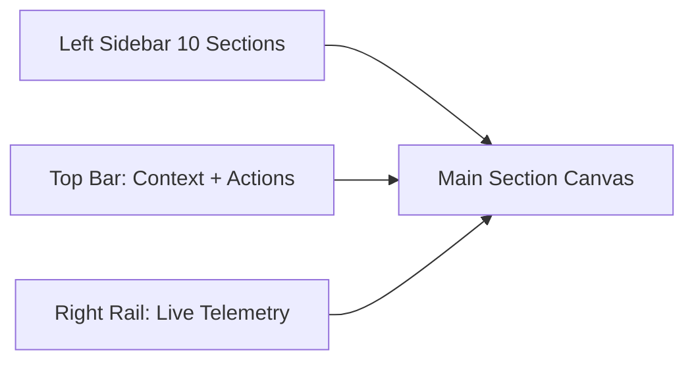
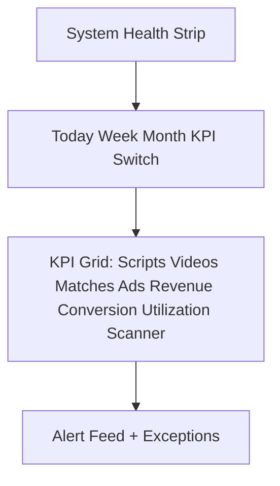
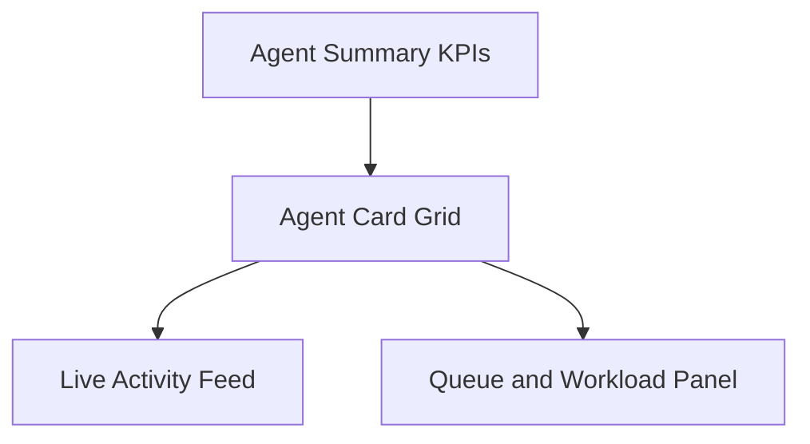
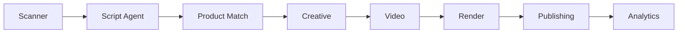
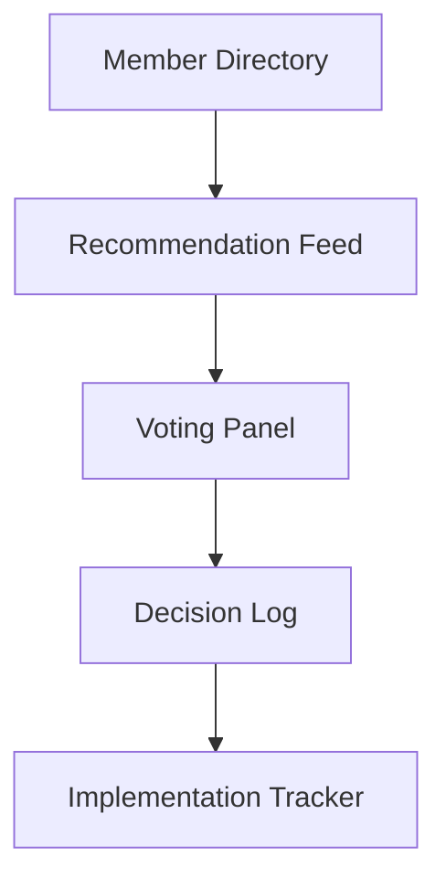

# EVICS Enterprise Rebuild Blueprint

Date: 2026-06-22
Scope: Full platform UX, navigation, workflow, and operations architecture redesign
Method: Functional audit from implementation evidence in code and routes, followed by consolidation architecture and production roadmap

## 1) Full UX Audit

### Audit evidence sources
- Next workspace shell and stage model: components/workspace/WorkspaceShell.tsx, components/workspace/StageTabs.tsx, store/useWorkspaceStore.ts
- Next action contracts: lib/actions.ts
- Legacy executive workspace runtime: workspace.html
- Legacy command/dashboard system: app.js
- Backend routes and surface routing: server.js
- Agent and pipeline telemetry layers: agent-event-bus.js, evics-persistence.js, evics-queue-workers.js, media-ops.js

### Current UX reality (executive summary)
- Two competing primary workspaces exist:
  - React/Next workspace at /workspace with 6 tabs and local state transitions.
  - Large static executive workspace at /workspace.html with 12 stages and mixed backend integration.
- A third legacy dashboard exists at /legacy-dashboard, heavily linked by both systems.
- Root workspace.html and public/legacy/workspace.html are byte-identical duplicates.
- Multiple controls are functional in UI but not system-functional (local-only transitions, no persisted backend action).

### Functional classification

#### Functional (real business function today)
- Media backend state retrieval and operations routes in server.js and media-ops.js.
- Render provider submit/status/callback route structure in server.js and render-provider-router.js.
- Agent event ingestion and timeline routes in server.js with event schema in agent-event-bus.js.
- Scanner settings/run route layer in server.js and media-ops.js.
- Brand profile retrieval/update routes and persistence path.
- Shopify sync and synced product retrieval routes.

#### Partially functional
- Next workspace panels (Create/Render/Review/Publish): mostly state-machine correct but action contracts are thin and non-persistent by default (lib/actions.ts).
- VP panel: command routing works for stage switches and opening surfaces, but many directives only route UI and do not execute enterprise command orchestration.
- Legacy workspace monitoring: polls backend and reflects data but mixes live and local simulated values.

#### Non-functional or low-confidence
- Any control whose only effect is local state mutation with no backend persistence.
- Enterprise-grade KPI claims not backed by persistent metric model (daily/weekly/monthly executive KPI panel is not normalized into a formal analytics model exposed to the new shell).

#### Duplicate
- workspace.html and public/legacy/workspace.html (duplicate file).
- Multiple navigation jump points across /workspace, /workspace.html, /legacy-dashboard for similar functions.
- Repeated scanner action controls in multiple rails and panels.

#### Obsolete/repetitive/no business-purpose in executive shell
- Cross-link clusters that expose many legacy sections from the modern shell (creates control clutter and split operating model).
- Parallel command surfaces that represent the same operational intent in different UI vocabularies.
- Any button that opens alternate dashboards for core actions instead of completing work in current context.

### What exists, what it does, what it should do, and disposition
- Primary command stage in Next shell: summarizes local counts and offers stage switches.
  - Should do: enterprise KPI and system-health command center with backend metrics only.
  - Decision: rebuild.
- Scanner panel in Next shell: shows findings, toggle, and run.
  - Should do: per-scanner telemetry + SLA + throughput + error budget.
  - Decision: keep core, rebuild data model and visuals.
- Media create/render/review/publish chain in Next shell.
  - Should do: persistent lifecycle, strict backend state, no local-only completion steps.
  - Decision: keep flow, replace local contracts.
- Evidence and Insights tabs in Next shell.
  - Should do: executive evidence and analytics center, not duplicate status cards.
  - Decision: merge into Analytics and Board reporting views.
- Legacy 12-stage executive workspace.
  - Should do: become modular sections under one enterprise navigation IA.
  - Decision: decompose and merge stage capabilities into 10 target sections.
- Legacy dashboard sections in app.js.
  - Should do: either become admin-only tools or be absorbed into standard enterprise sections.
  - Decision: consolidate and hide from primary executive nav.

## 2) Navigation Rebuild Plan

### Target left sidebar (single source of navigation)
1. Executive Command Center
2. Agent Operations
3. EVIE Intelligence
4. Viral Intelligence
5. Creative Studio
6. Publishing Center
7. Product Intelligence
8. Board of Directors
9. Analytics
10. Settings

### Global IA rules
- One primary shell only.
- No outbound links from primary sections to alternate dashboards for core workflows.
- Legacy/admin tools move under Settings as admin utilities.
- Right rail reserved for context telemetry, not duplicate navigation.

### Routing map
- /workspace/command-center
- /workspace/agent-operations
- /workspace/evie-intelligence
- /workspace/viral-intelligence
- /workspace/creative-studio
- /workspace/publishing-center
- /workspace/product-intelligence
- /workspace/board-of-directors
- /workspace/analytics
- /workspace/settings

## 3) Workspace Consolidation Plan

### Consolidation matrix
- Next Command + Legacy command + Legacy executive nexus -> Executive Command Center.
- Next Scanners + scanner controls from legacy media ops -> Agent Operations and Analytics.
- Legacy semantic memory/autonomous ops/system core slices -> EVIE Intelligence + Agent Operations.
- Legacy discovery/viral/commercial trend surfaces -> Viral Intelligence.
- Next Media/Create/Render + legacy studio/export tools -> Creative Studio.
- Next Review/Publish + legacy queue -> Publishing Center.
- Legacy matching/products-dashboard/synced-products -> Product Intelligence.
- Legacy executive_boardroom + strategic forecasting views -> Board of Directors.
- Next Insights + legacy intelligence lab + evidence summaries -> Analytics.
- Brand profile, API connections, vault, provider config surfaces -> Settings.

### Hard removals in phase cutover
- Remove root-level navigation links that open legacy-dashboard for core operations.
- Remove duplicated workspace.html exposure once enterprise shell reaches parity.
- Hide controls with no backend action endpoint until implemented.

## 4) Database Impact Report

### Current persistence model observed
- JSON-backed operational state in media-ops-state.local.json and evics-pipeline-state.local.json.
- Collections in evics-persistence.js:
  - media_assets
  - render_jobs
  - prompt_compiler_outputs
  - delivery_records
  - agent_events
- Media model in media-ops.js includes lifecycle, render status, approval, publish state, quality, compliance, and telemetry fields.

### Gaps against enterprise target
- No normalized section-level KPI fact tables.
- No first-class agent utilization/performance entity with time-window aggregations.
- No board recommendation entity and voting ledger.
- Scanner metrics are present but not normalized for executive time slicing.

### Required schema additions (logical)
- kpi_snapshots: day/week/month aggregates by metric and section.
- agent_runtime_stats: per agent, per interval, status transitions, success rate, queue depth, workload.
- scanner_runtime_stats: per scanner, throughput, latency, error, discoveries.
- pipeline_stage_metrics: per stage timing, success, quality, queue.
- board_recommendations: recommendation, owner, status, impact score, vote result, implementation link.
- vp_directives: directive lifecycle, decision log, autonomy status, outcome.

### Migration strategy
- Phase A: dual-write from current route handlers into both legacy JSON and normalized tables.
- Phase B: switch shell reads to normalized tables/API.
- Phase C: retire JSON state as source-of-truth.

## 5) Agent Monitoring Architecture

### Target model
- Event ingest: POST /api/agents/events remains command/event ingest gateway.
- Timeline read: GET /api/agents/timeline remains real-time feed source.
- Introduce agent status projection service:
  - Consumes agent_events.
  - Computes current status, elapsed time, queue position, workload, productivity score, success rate.
- Expose endpoint: GET /api/agents/operations-summary.

### Agent card required fields
- Agent Name
- Current Task
- Status
- Current Job
- Started Time
- Elapsed Time
- Success Rate
- Productivity Score
- Output Count
- Queue Position
- Workload %

### Activity feed
- Unified chronological feed from normalized events, filterable by agent, stage, severity.

## 6) Workflow Tracking Architecture

### Canonical pipeline
Scanner -> Script Agent -> Product Match Agent -> Creative Agent -> Video Agent -> Render Agent -> Publishing Agent -> Analytics Agent

### State machine
- waiting (gray)
- working (blue)
- processing (yellow)
- completed (green)
- failed (red)

### Required metrics per stage
- time_spent_ms
- accuracy_score
- success_rate
- output_quality
- queue_count
- current_task

### Runtime mechanics
- Stage transition emitted as event.
- Projection updates stage card status in real time.
- Completion event of stage n auto-activates waiting indicator for stage n+1.

## 7) Board of Directors Architecture

### Domain entities
- board_members
- board_recommendations
- board_votes
- board_decisions
- board_impact_tracking

### Board workspace modules
- Member Directory
- Recommendation Feed
- Voting Console
- Decision Log
- Implementation Tracker

### Required member card fields
- Name
- Specialty
- Last Recommendation
- Strategic Input
- Impact Score
- Suggestions Submitted
- Suggestions Implemented

### Searchability
- Full text search over recommendations, decisions, and implementation notes.

## 8) VP Operations Architecture

### VP dashboard modules
- Current Directives
- Completed Directives
- Pending Directives
- Autonomous Decisions
- Performance Rating
- System Efficiency
- Productivity Metrics
- VP Activity Timeline
- VP Recommendations
- VP Improvement Suggestions
- Live Voice Command Status
- Executive Command Queue

### Directive lifecycle
- received -> classified -> approved/denied -> executed -> verified -> archived

### Integration
- Voice and typed directives map into vp_directives table.
- Each directive links to resulting events, affected agents, and KPI impact.

## 9) Scanner Monitoring Architecture

### Scanner operational model
- Each scanner has dedicated dashboard card and detail view.
- Telemetry stream writes scanner_runtime_stats.

### Required scanner metrics
- status (running/stopped/paused)
- speed_meter
- accuracy_meter
- performance_meter
- success_meter
- data_collected_today
- data_collected_week
- data_collected_month
- scripts_discovered
- ads_discovered
- videos_discovered
- winning_hooks
- winning_ctas
- winning_trends

### Feed
- Real-time scrape/discovery feed with source, confidence, and category tags.

## 10) Final Enterprise UI/UX Design Specification

### Design language
- Theme: Dark Luxury Enterprise
- Base background: #0B0F17
- Panel base: #111827
- Accent strategy: restrained metallic amber + cold cyan for signal context only
- No neon, no toy-style cards, no visual noise

### Typography
- Executive-grade geometric grotesk for headings, neutral sans for data cells
- Large KPI numerics with high contrast and measured spacing
- Dense but breathable enterprise layout rhythm

### Component behavior principles
- Every button requires an implemented backend action contract.
- Every KPI requires source mapping to metrics endpoint.
- Every stage color reflects real runtime status only.
- Empty states must indicate missing operational precondition, not decorative placeholders.

### Accessibility and quality bars
- WCAG AA contrast
- Keyboard traversable command interactions
- No blocking animations on critical controls
- Latency budget for dashboard updates under 2s for projected metrics refresh

## 11) Component Map

### Shell-level components
- EnterpriseShell
- LeftSidebarNav
- GlobalTopBar
- ContextRail
- NotificationCenter

### Section components
- CommandCenterHealthGrid
- ExecutiveKpiPanel
- AgentOperationsBoard
- PipelineFlowBoard
- EvieIntelligenceExplorer
- ViralIntelligenceExplorer
- CreativeStudioComposer
- PublishingControlCenter
- ProductIntelligenceBoard
- BoardOfDirectorsHub
- AnalyticsWorkbench
- SettingsControlPlane

### Shared components
- StatusChip
- MetricCard
- TimelineFeed
- DataTable
- StageNode
- AgentCard
- ScannerCard
- DirectiveCard
- RecommendationCard

## 12) Wireframe Layouts

### Global shell wireframe

### Executive command center wireframe

### Agent operations wireframe

### Pipeline tracking wireframe

### Board center wireframe

## 13) Development Roadmap

### Wave 1: foundation and cleanup
- Freeze new UI additions.
- Remove duplicate nav links and dead outbound jumps from primary shell.
- Introduce enterprise route skeleton and sidebar IA.
- Create metrics projection APIs for command center and agent operations.

### Wave 2: operational sections
- Build Executive Command Center and Agent Operations using live APIs only.
- Implement pipeline flow board with status color semantics.
- Move scanner runtime into dedicated scanner intelligence views.

### Wave 3: intelligence and governance
- Build EVIE Intelligence and Viral Intelligence search/index views.
- Build Board of Directors center and VP operations center.
- Add recommendation voting and directive logs.

### Wave 4: hardening and deprecation
- Migrate all core actions to backend-persistent commands.
- Remove workspace.html and legacy-dashboard from primary runtime path.
- Keep legacy/admin tools under settings/admin only until retired.

## 14) Priority Order for Implementation

1. Eliminate duplicated primary navigation paths.
2. Replace local-only action contracts in Next workspace with backend calls.
3. Stand up command center KPI APIs and system health strip.
4. Build agent operations cards and live feed projection.
5. Build pipeline tracker with stage timing and quality metrics.
6. Normalize scanner telemetry and expose scanner intelligence center.
7. Add Board and VP operational domains.
8. Consolidate publishing/product intelligence flows.
9. Finalize visual design system and cross-section consistency.
10. Deprecate duplicate legacy surfaces.

## 15) Complete Build Blueprint (Production Ready)

### Target architecture
- Frontend: single enterprise shell (Next) with section-based routing.
- Backend: existing Express routes extended with projection endpoints and normalized persistence.
- Data: migrate from file-based state to normalized operational tables with dual-write transition.
- Realtime: timeline and stage updates via polling to start, event stream upgrade next.

### Non-negotiable production acceptance criteria
- No primary action button without a backend contract.
- No duplicate dashboard for same business function.
- No local-only state transition for workflow-critical steps.
- All KPI widgets map to a documented metric source.
- Agent, scanner, and pipeline states are observable in real time.

### Cutover definition of done
- Single left sidebar with the 10 mandated sections.
- Executive Command Center operational with today/week/month KPIs and system health.
- Agent Operations and Pipeline Tracking fully live.
- Board and VP centers operational with stored searchable decisions/directives.
- Legacy surfaces restricted to admin compatibility, not primary operations.

---

## Immediate removals and merges (action list)
- Remove duplicate workspace file in public/legacy once route compatibility is verified.
- Remove modern-shell links that bounce operators to legacy sections for core work.
- Merge Evidence and Insights into Analytics.
- Merge Review and Publish governance into Publishing Center.
- Move Classic EVICS links into Settings > Legacy Tools only.

## Risk register (top)
- Risk: user disruption from abrupt legacy removal.
  - Mitigation: feature flags and phased route redirects.
- Risk: KPI mismatch during migration.
  - Mitigation: dual-read validation period.
- Risk: local state artifacts diverge from backend.
  - Mitigation: disable local-only transition paths as backend endpoints come online.

## Executive recommendation
Proceed with a two-track execution:
- Track A: IA + shell + UX simplification (remove clutter first).
- Track B: observability/data normalization for agent/scanner/pipeline metrics.

This sequence minimizes UI debt immediately while enabling true enterprise command behavior.
